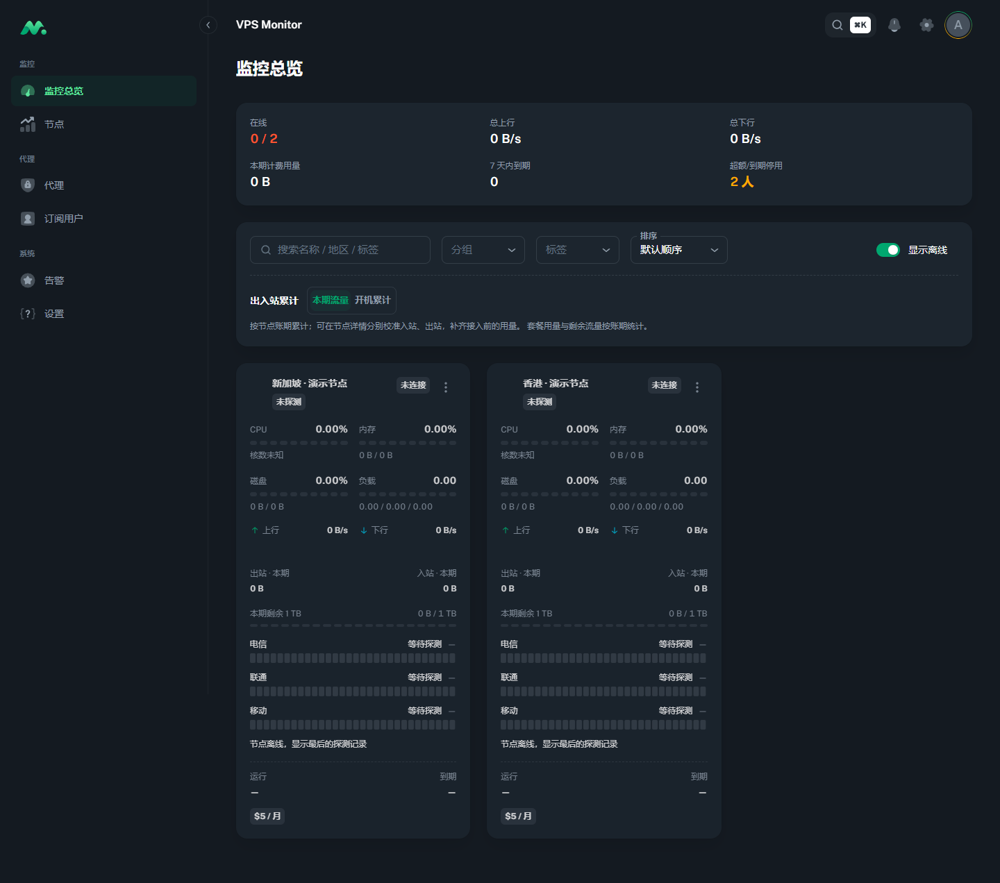
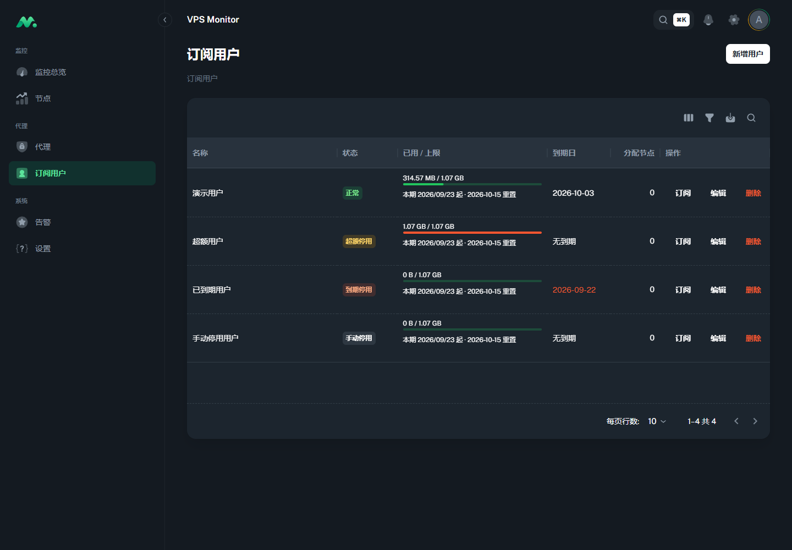

# VPS Monitor

[](https://github.com/han-cczu/vps-monitor/actions/workflows/ci.yml)

自托管的 VPS 监控与代理节点管理面板。Go 服务端内嵌 React 前端，节点通过 Agent 和 WebSocket 上报状态，配置与历史记录保存在 SQLite 中；配套部署使用 Caddy 提供 HTTPS。

## 项目状态

- 原 01–20 步计划的代码已实现，目标环境验收尚未全部完成。下方功能表描述实现范围。
- 已有 Windows Go 检查、Linux 集成链路、浏览器界面与部分公网节点的验证记录，见[集成验收](docs/verify/completion.md)和[外部代理观测验收](docs/verify/external-proxy-observation.md)。
- 仍需补齐公网域名 TLS / 干净 VPS 完整安装、ARM64 实机、真实手机与通知渠道、双 VPS 中转及多日运行等验收；Webhook / Telegram 通知已实现，真实渠道投递尚待验证。
- 截至 2026-09-23，已发布 [v0.2.4](https://github.com/han-cczu/vps-monitor/releases/tag/v0.2.4)，并核实对应 Linux amd64 镜像可匿名获取；[实施进度](docs/进度.md)中的“尚未发布”是 2026-09-14 的历史快照。

## 界面预览

以下为 2026-09-23 使用当前代码构建后截取的页面。节点与订阅数据来自隔离演示环境，节点未连接真实 VPS，用量仅用于展示界面。

**监控总览**



<details>
<summary>查看订阅用户界面</summary>



</details>

## 能做什么

| 场景 | 功能 |
| --- | --- |
| 节点监控 | 实时状态、历史曲线、Ping 探测、账单与流量套餐；本期 / 开机累计流量切换，入站、出站分别校准。 |
| 托管代理 | 管理 sing-box 核心与配置，支持配置预检与失败回滚，以及 VLESS Reality、Shadowsocks 2022、Hysteria2、TUIC。 |
| 外部代理观测 | 只读查看已有 sing-box / Xray 实例的运行与入站信息，不接管外部实例的配置、重启或卸载。 |
| 订阅与用量 | 订阅用户、多种订阅格式、流量配额、到期控制与中转管理。 |
| 运维 | 告警规则、Webhook / Telegram 通知、TOTP、审计、备份、版本检查与 Agent 更新。 |

界面提供中文、深浅色主题和移动端布局。Agent 提供 Linux amd64 / arm64 产物，安装脚本支持 systemd 与 OpenRC；**托管 sing-box 核心仍要求 systemd**。其他环境及外部实例的观测边界见[支持范围](docs/verify/external-proxy-observation.md#支持边界)。

## Docker 部署

### 使用发布镜像

下面以 Linux amd64 主机和 `v0.2.4` 为例。先准备：

- 一个已解析到部署主机的域名，并在云安全组及主机防火墙放通 TCP 80/443。
- Docker Engine 与 Compose 插件。新 VPS 可先按 [Docker 官方安装步骤](https://docs.docker.com/engine/install/ubuntu/)完成安装；下列命令使用 `sudo docker`。
- Git 与 OpenSSL；Ubuntu / Debian 可通过 `sudo apt-get update` 和 `sudo apt-get install -y git openssl` 安装。

获取对应版本的文件并准备配置：

```sh
git clone --branch v0.2.4 --depth 1 https://github.com/han-cczu/vps-monitor.git
cd vps-monitor/deploy
cp .env.example .env
chmod 600 .env
openssl rand -hex 32
```

编辑当前目录的 `.env`（仓库内路径为 `deploy/.env`），将下面三项替换为实际值；其余配置可先保留[示例](deploy/.env.example)的默认值。`VM_JWT_SECRET` 填入刚生成的随机字符串，至少 32 字节。

```dotenv
PANEL_DOMAIN=panel.example.com
SERVER_IMAGE=ghcr.io/han-cczu/vps-monitor-server:0.2.4
VM_JWT_SECRET=替换为刚生成的随机字符串
```

`deploy/.env.example` 中的 `ghcr.io/OWNER/...` 是占位符，必须替换。仍在 `deploy/` 目录中执行：

```sh
sudo docker compose pull
sudo docker compose up -d
sudo docker compose logs --tail=100 server
```

首次启动会创建管理员 `admin`，随机初始密码只在日志中输出一次，项目没有通用默认密码。访问 `https://你的域名` 登录，在「设置 → 账号」修改密码；可访问 `https://你的域名/api/health` 检查 HTTP 服务。

登录后进入「节点 → 新增节点」，保存并复制一次性显示的 Agent 安装命令，在目标 Linux 节点以 root 权限执行。镜像已携带双架构 Agent 与安装脚本；连接成功后，面板会收到节点状态。托管代理还需在「设置 → 代理核心」准备 sing-box 产物，详见[运维手册](docs/runbook.md)。

[Compose](deploy/docker-compose.yml)只向外暴露 Caddy 的 80/443，服务端 9000 位于内部网络。业务数据保存在 `deploy/data/`，Caddy 证书保存在命名卷中；升级前先备份，恢复步骤见[恢复说明](deploy/restore.md)。

### 从源码构建镜像

需要**完整仓库**：Dockerfile 会依次构建 `web/`、Go 服务端和两个架构的 Agent，构建上下文必须是仓库根目录。在部署主机的仓库根目录执行：

```sh
sudo docker build -f deploy/Dockerfile -t vps-monitor-server:local .
```

按上节准备 `deploy/.env`，将 `SERVER_IMAGE` 改为 `vps-monitor-server:local`，然后运行：

```sh
cd deploy
sudo docker compose up -d
sudo docker compose logs --tail=100 server
```

宿主机无需单独安装 Go / Node.js。默认源码构建的版本标识为 `dev`；正式发布流程见[发布工作流](.github/workflows/release.yml)。当前发布镜像仅包含 Linux amd64，不能把双架构 Agent 的支持范围等同于面板镜像的架构范围。

## 本地开发

需要 Go 1.26.8、Node.js 24 和 npm。以下命令可直接在 Windows PowerShell 或 Linux / macOS 终端中运行，工作目录均为仓库根目录。

先安装前端依赖：

```sh
npm --prefix web ci
```

打开两个终端，分别启动服务端和前端：

```sh
# 终端一：Go 服务端，默认监听 :9000
go run ./server/cmd/server
```

```sh
# 终端二：Vite 前端，默认监听 :8080，代理 API 和实时 WebSocket 到 :9000
npm --prefix web run dev
```

访问 <http://localhost:8080>；服务端健康检查为 <http://localhost:9000/api/health>。首次登录方式与 Docker 部署相同，密码见服务端终端日志。本地数据默认写入 `./data`。

本地开发不会自动准备 Agent 下载文件。要使用面板生成的安装命令，需先构建 Agent，将产物放到 `{VM_DATA_DIR}/agent/`，并配置节点可访问的 `VM_PUBLIC_URL`；步骤见[Agent 分发说明](docs/runbook.md#节点与-agent-分发步骤-03)。

## 常用配置

服务端从环境变量读取配置。[Compose 配置](deploy/docker-compose.yml)会将 `deploy/.env` 中声明使用的值传入容器；仅向 `.env` 添加变量不会自动让容器读取它。

| 配置项 | 默认 / 示例行为 | 用途 |
| --- | --- | --- |
| `PANEL_DOMAIN` | Compose 示例为 `panel.example.com` | Caddy 域名，部署时必填实际值。 |
| `SERVER_IMAGE` | Compose 示例为 `ghcr.io/OWNER/...` | 必须替换为发布镜像或本地镜像标签。 |
| `VM_LISTEN` | `:9000` | 服务端监听地址。 |
| `VM_DATA_DIR` | 本地 `./data`；容器 `/data` | 数据库、密钥、核心文件和 Agent 产物目录。 |
| `VM_PUBLIC_URL` | 本地为空；Compose 根据域名生成 HTTPS URL | 用于生成节点可访问的安装地址。 |
| `VM_JWT_SECRET` | 本地为空时生成并保存；Compose 从 `.env` 读取 | JWT 签名和 TOTP 密钥加密所需的主密钥。 |
| `VM_TZ` | `Asia/Shanghai` | 账期与定时任务使用的业务时区。 |
| `VM_TRUSTED_PROXIES` | 本地为空；Compose 固定为 `1` | 可信代理层数或网段；改变代理拓扑时同步调整 Compose。 |
| `VM_UPDATE_REPOSITORY` | `han-cczu/vps-monitor` | 版本检查使用的 GitHub 仓库；检查本身不安装更新。 |

全部配置与含义见[运维手册](docs/runbook.md#环境变量)。

## 安全部署

- 使用 HTTPS，首次登录后更改随机密码，并按需要启用 TOTP。数据库、备份、`.env`、节点 token 和订阅链接应限制访问；数据库与原 JWT 主密钥需一并备份，恢复方法见[运维手册](docs/runbook.md)。
- `VM_TRUSTED_PROXIES=1` 对应当前单层 Caddy 拓扑。增加 CDN 或其他反向代理后，按实际层数或网段调整，并核对审计中的客户端 IP；误配会影响登录限速与审计。保持服务端 9000 仅供可信代理访问。
- [Caddyfile](deploy/Caddyfile)提供 IP 白名单示例。若限制整个站点，需同时考虑 Agent 与订阅客户端的访问来源，避免将它们拦截。
- 保留 Caddy 对订阅路径、query token 和 Referer 的访问 / 错误日志脱敏配置。发布前检查与已知边界见[安全检查表](docs/security-checklist.md)。

## 检查与构建

以下是本地常用检查，需先安装前端依赖：

```sh
go vet ./proto/... ./agent/... ./server/...
go test ./proto/... ./agent/... ./server/...
npm --prefix web test
npm --prefix web run tsc:check
npm --prefix web run lint
npm --prefix web run build
```

完整 [CI](.github/workflows/ci.yml)还包括 `govulncheck`、多组 `go test -race`、双架构 Agent 交叉编译、OpenRC 容器安装测试和 npm 生产依赖审计。竞态检测需要相应 C / CGO 工具链，OpenRC 测试需要 Docker。

[Makefile](Makefile)使用 `/bin/sh`、`mkdir`、`cp` 等 Unix 工具，适合在 Linux / macOS / WSL 中运行。安装 GNU Make 后，`make build` 构建 Linux amd64/arm64 Agent 与当前主机平台的服务端；`make build-server` 会先构建并同步前端再编译服务端。Windows 原生环境可使用上面的 Go / npm 命令，内嵌前端的完整构建可使用 Docker。

仓库根目录没有 `go.mod`，Go 检查需显式列出 `proto`、`agent`、`server` 三个模块。推送 `main` 或创建 PR 会运行 CI；`v*` 标签触发镜像与 Agent 发布，sing-box 工作流需手动触发。

## 项目结构与文档

| 路径 | 内容 |
| --- | --- |
| `server/` | HTTP / WebSocket API、认证、SQLite、订阅、告警与任务调度。 |
| `agent/` | 节点采集、连接、代理核心控制与更新。 |
| `proto/` | 服务端与 Agent 共用的协议定义。 |
| `web/` | React 管理界面。 |
| `deploy/` | Docker、Caddy、备份与恢复文件。 |
| `ci/` | 集成验证脚本。 |
| `docs/` | 设计、实施计划、验收记录与运维手册。 |

| 文档 | 内容 |
| --- | --- |
| [运维手册](docs/runbook.md) / [恢复说明](deploy/restore.md) | 安装、配置、升级、备份、账号恢复与排障。 |
| [安全检查表](docs/security-checklist.md) | 已验证的安全行为、证据与部署前复核项。 |
| [设计方案](docs/设计方案.md) / [通信协议](docs/protocol.md) | 项目设计与 Server–Agent 协议。 |
| [前端说明](web/README.md) / [核心版本说明](docs/core-version.md) | 前端来源、开发约定与 sing-box 构建要求。 |
| [实施进度](docs/进度.md) / [集成验收](docs/verify/completion.md) | 带日期的实施快照、测试证据与待验边界。 |
| [外部代理观测](docs/proxy-observation-protocol.md) / [观测验收](docs/verify/external-proxy-observation.md) | 第三方代理只读观测协议和支持范围。 |

数据库、密码、环境配置、依赖目录和构建产物不随源码上传。验收文档保留形成时的环境与日期，不能作为后续所有版本和部署环境均已通过的证明。
