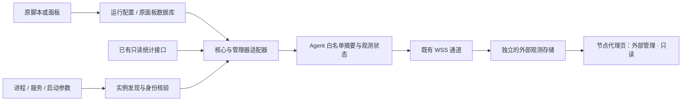

# 步骤 21 · 第三方代理只读观测

> 状态：已实现并上线；面板及两节点探针为 v0.2.0，声明支持范围内的验收已完成。
> 日期：2026-09-15。
> 目标：第三方项目继续管理代理，本面板自动发现并展示信息。优先适配 `sing-box-yg`、`x-ui-yg`，通过通用 sing-box / Xray 适配器覆盖其他安装方式。
> 本文主体保留原始调研时的待核验事项，不将原始清单全部勾选为已实测。2026-09-15 已通过授权 SSH 核实两节点、升级探针并完成公网浏览器验收；原代理配置、核心文件和服务未修改。当前实现、实际覆盖范围、发布版本及未验收边界以 [验收记录](../verify/external-proxy-observation.md) 为准。

## 1. 预期结果

安装或升级探针后，节点代理页能显示外部实例的核心类型、版本、运行状态、服务来源、实际入站和可用统计。面板明确标注“外部管理 · 只读”，原脚本/面板仍负责升级、重启、配置、证书、用户及流量重置。

第一批实际验证对象由用户指定：

| 对象 | 用户提供的信息 | 本轮核验边界 | 实施后的目标 |
|---|---|---|---|
| 公网面板 | `https://43.156.207.51/` | 浏览器可正常打开，跳转到登录页；当前浏览器未登录 | 通过已登录页面验收两种外部实例展示 |
| `DediOne` | 已部署 sing-box | 用户截图显示版本“未安装”、运行中、入站 0、统计 RPC 失败；未读取该机配置，不能据此断言具体安装脚本或路径 | 识别实际 sing-box；若符合 `sing-box-yg` 特征则标注来源，展示其入站 |
| `nodemach` | 已部署 `x-ui-yg` | 用户提供的对应关系；未读取该机进程、数据库或运行配置 | 识别 x-ui 管理的 Xray，并展示实际入站及原面板可提供的用量 |

“适配其他脚本”按实际核心、启动参数和可读取的数据源实现。其他脚本安装的 sing-box / Xray 可复用通用能力；不同核心、特殊数据库和封闭管理接口需要新增适配器，不承诺自动理解任意软件。

## 2. 调研结论与证据

### 2.1 sing-box-yg

本轮固定阅读提交 `9e8b710c191d0cfd43f50f3d35d11b5ff0c314bc`。

| 项目 | 已核实内容 | 对实现的要求 |
|---|---|---|
| 核心 | `/etc/s-box/sing-box` | 不能只查 `/usr/local/bin/sing-box` |
| 生效配置路径 | 服务启动参数为 `run -c /etc/s-box/sb.json` | 以运行参数为准，不能把 `sb10.json`、`sb11.json` 备份/模板当成独立实例 |
| 服务 | systemd `sing-box.service`；Alpine 使用 OpenRC `sing-box` | 服务名可与本项目完全相同，名称不能证明管理归属 |
| 配置格式 | 脚本处理配置时会移除注释；存在不同版本模板 | 使用真正的 JSON/JSONC 解析器，不能用正则删除 `//`，以免损坏字符串里的 URL |
| 协议 | 项目支持 VLESS、VMess、Hysteria2、TUIC、AnyTLS | 只读展示不能被当前四种可编辑协议限制 |
| 默认统计 | 检查的服务端生成模板没有配置 `v2ray_api`；脚本中的 `clash_api` 出现在客户端配置生成部分 | 默认显示“未配置统计接口”；不能因为看到客户端 `9090` 就探测或读取它 |

来源：[服务启动方式](https://github.com/yonggekkk/sing-box-yg/blob/9e8b710c191d0cfd43f50f3d35d11b5ff0c314bc/sb.sh#L879-L911)、[服务端模板](https://github.com/yonggekkk/sing-box-yg/blob/9e8b710c191d0cfd43f50f3d35d11b5ff0c314bc/sb.sh#L423-L876)、[客户端配置生成](https://github.com/yonggekkk/sing-box-yg/blob/9e8b710c191d0cfd43f50f3d35d11b5ff0c314bc/sb.sh#L1265-L1425)、[项目说明](https://github.com/yonggekkk/sing-box-yg/blob/9e8b710c191d0cfd43f50f3d35d11b5ff0c314bc/README.md)。

注意：上述是所查上游版本，不等于 `DediOne` 当前安装版本。仓库另有 Serv00/Hostuno 用户目录、随机文件名和后台启动变体；第一轮不将这些特殊平台纳入“已支持 Linux VPS 安装”的验收结论。

### 2.2 x-ui-yg

本轮固定阅读提交 `a51267d2a012b357ea647c52a61763b30d486f1b`，并静态检查其 `xui_yg` 发布包。

| 项目 | 已核实内容 | 对实现的要求 |
|---|---|---|
| 实际核心 | 安装脚本配置 `bin/xray-linux-${cpu}`；发布包包含 Xray | 展示为 Xray；能导出 sing-box 订阅不等于服务端运行 sing-box |
| 管理进程 | `/usr/local/x-ui/x-ui`，systemd `x-ui.service`；也有 OpenRC 分支 | 区分“x-ui 面板运行”和“Xray 子进程运行” |
| 运行配置 | 脚本从 `/usr/local/x-ui/bin/config.json` 读取代理入站 | 优先核对 Xray 实际命令行；`sbox.json` 是客户端订阅产物 |
| 数据库 | 脚本说明备份数据库为 `/etc/x-ui-yg/x-ui-yg.db` | 本地只读数据库是候选统计来源；实际表结构需现场或隔离环境核实 |
| 统计示例 | 仓库 `config.json` 启用 StatsService、入站及用户统计，示例 API 端口为 `127.0.0.1:62789` | 示例不是现场配置；不能固定端口，也不能假设用户计数一定存在 |
| 面板数据模型 | 发布包嵌入的 `DBInbound` 包含 `up/down/total/enable/expiryTime`；入站列表调用 `/xui/inbound/list` | 有读取原面板入站用量的适配方向；不能套用其他 x-ui 分支的 API 或数据库结构 |

来源：[安装脚本](https://github.com/yonggekkk/x-ui-yg/blob/a51267d2a012b357ea647c52a61763b30d486f1b/install.sh#L159-L189)、[数据库备份说明](https://github.com/yonggekkk/x-ui-yg/blob/a51267d2a012b357ea647c52a61763b30d486f1b/install.sh#L354-L382)、[运行配置读取](https://github.com/yonggekkk/x-ui-yg/blob/a51267d2a012b357ea647c52a61763b30d486f1b/install.sh#L1492-L1495)、[统计配置示例](https://github.com/yonggekkk/x-ui-yg/blob/a51267d2a012b357ea647c52a61763b30d486f1b/config.json#L1-L31)、[发布包](https://github.com/yonggekkk/x-ui-yg/releases/tag/xui_yg)。

发布包证据：`x-ui-linux-amd64.tar.gz`，29,433,952 字节，SHA-256 为 `245198549eb44e70f8944590880f678c98cf46498d1c48152ef25742763c542a`，下载后与 GitHub API 的 digest 一致。仅解包、读取 unit、构建元数据和嵌入前端字符串，没有执行包内程序。发布资产可被替换，后续测试必须重新记录摘要。

已检查的仓库文件树未包含面板服务端 Go 源码。嵌入前端只能证明字段与调用线索，不能证明实际 SQL 表名、权限、统计刷新周期、重置行为或每用户统计能力。实现前必须完成下述 P0 核验，不能假定存在 `client_traffics` 表或 `/panel/api/inbounds/list` 接口。

### 2.3 当前项目的耦合点

本地参考 HEAD：`f6d4b0391825c92a422f331e79f99682e5180907`，包含同期完成的流量校准功能。本方案不修改这部分代码，后续迁移序号按实施时实际状态分配。

| 当前实现 | 证据位置 | 需要解决的问题 |
|---|---|---|
| 固定核心、配置、日志、unit 路径 | `agent/internal/corectl/paths.go` | 外部路径和多实例不能发现 |
| 版本与运行状态独立检测 | `state.go`、`systemd.go` | 版本缺失会被 UI 错写为“未安装” |
| `/proc/net` 整体读取 | `ports.go` | 当前端口列表未绑定核心 PID，不能代表代理入站 |
| 统计 `QueryStats` 使用 `Reset_: true` | `stats.go:93` | 不能用于外部实例，否则会清零原项目计数 |
| Manager 启动执行恢复，后台可能截断日志 | `manager.go`、`apply.go`、`logrotate.go` | 禁用按钮无法阻止后台写入或重启 |
| 安装可重写同名 unit；卸载可 stop/disable 同名服务 | `install.go`、`agent/uninstall.sh` | 同名第三方服务可能被误操作 |
| 单节点单个 `node_core`，旧消息只接受 sing-box | `proto/core.go`、`server/internal/proxy/core.go` | Xray 和多实例不能直接塞进旧模型 |
| 统计仅关联本面板用户、入站 | `server/internal/proxy/stats.go` | 外部数据不能直接进入本面板订阅用户结算 |
| 当前探针安装器仅支持 systemd | `agent/install.sh` | 支持脚本的 Alpine 分支还需要探针 OpenRC 安装/卸载配套 |

## 3. 功能范围与展示

### 3.1 首轮目标

| 能力 | sing-box-yg | x-ui-yg | 其他 sing-box / Xray 安装方式 |
|---|---|---|---|
| 实例、版本、运行状态、服务/进程来源 | 支持 | 同时显示 x-ui 与 Xray 状态 | 通用发现 + 手动绑定路径 |
| 入站协议、标签、地址、端口、传输、TLS/Reality 状态 | 解析运行配置 | 解析 Xray 运行配置，数据库补充禁用项与备注 | 按核心配置格式解析 |
| 用户数量 | 只统计实际配置中可识别的用户条目 | 按实际数据源提供 | 缺少数据时显示未知 |
| 进程资源与实际端口 | PID/命名空间关联后展示 | 关联 Xray 子进程 | 可确认归属时展示 |
| 原面板累计用量、额度、到期 | 无此来源时不提供 | 完成数据库验证后展示入站级原始值 | 有适配后的原管理器数据源才提供 |
| 每入站/用户实时流量 | 已有可用统计接口时按能力提供 | 优先原面板来源，不承诺凭核心采样完整重建 | 按数据源能力提供 |
| 其他/新协议 | 展示原始协议名及公共字段 | 同左 | 不支持的字段明确缺失，整条入站仍保留 |

“配置中存在”“原面板启用”“进程实际监听”“最近确认已应用”分别记录。读取到配置文件不能证明全部内容已加载；外部管理器未提供应用证据时，显示“已读取配置，应用状态未确认”。

第一轮不自动生成或导入外部订阅，不上传原始配置、密码、UUID、私钥、Argo Token。外部用户与本面板订阅用户保持独立；未来如需分享节点，应作为单独明确的数据展示功能设计。

### 3.2 页面行为

节点详情允许展示多个实例，并区分：

- `managed`：本项目有明确管理记录且资源身份核验一致；保留当前管理功能。
- `external`：由其他项目管理；显示“外部管理 · 只读”。
- `unknown`：发现代理但管理归属不确定；默认只读。

来源提示为 `sing-box-yg`、`x-ui-yg`、`通用 sing-box`、`通用 Xray`。只有匹配到足够的路径、运行参数和管理器证据才标注具体脚本；不能从一个文件名推断来源。

外部实例页面提供“刷新观测”和“编辑探针采集绑定”入口，后者只修改本项目采集设置。安装、升级、重启、重新下发、回滚、增删入站、修改用户、签发证书等管理入口不出现在外部实例中，后端和 Agent 同时拒绝这些动作。

普通缺失能力使用中性提示，例如：

- “已发现 sing-box，版本暂时无法读取”。
- “未配置统计接口，入站信息仍可查看”。
- “用量来自原 x-ui 面板，最近更新于 …”。
- “原管理器可能重置计数，本数据不用于账期结算”。
- “读取失败，显示上次成功观测”。

不再把“没有统计能力”循环显示成核心故障；配置解析失败、权限不足和实例消失分别提示。外部实例不显示本项目“托管版本尚未设置”或修订 `0/0`。

## 4. 实现结构

### 4.1 发现、解析、统计分层

新增 `agent/internal/proxyobserve`，不让外部实例复用带安装/恢复/日志维护职责的 Manager。

1. **发现层**：Linux `/proc`、systemd/OpenRC 信息、已知路径提示、用户指定绑定，产出候选实例及来源证据。
2. **核心解析层**：`singbox`、`xray`，负责配置和公共入站字段；不携带修改配置的方法。
3. **管理器适配层**：`sing-box-yg`、`x-ui-yg`、`generic`，补充安装布局、原面板元数据、数据源选择。
4. **统计层**：原面板只读数据、sing-box V2Ray API、Xray Stats API 分别实现；每种返回自己的范围、时间和质量说明。

新增脚本如果只是换路径或服务名，增加发现规则即可；只有配置结构或统计来源发生变化才需要新的解析器/适配器。首轮允许管理员在本地 Agent YAML 显式绑定 `core/service/binary/config_paths/database`，不支持任意 shell 命令作为“自定义采集器”。

### 4.2 实例发现和身份

- 用 `/proc/<pid>/exe`、`cmdline`、`cwd`、父进程和进程开始时间确认实际核心；unit 信息用于辅助，不单独信任显示名。
- 区分 x-ui 管理器和它启动的 Xray；多个实例不合并为一台节点的单个 running 布尔值。
- 相对 `-c/-config` 路径以进程工作目录解析；配置目录、多文件参数按对应核心的加载顺序处理。无法确认合并顺序时只标为候选，不能伪造“生效配置”。
- 已知路径用于定位停止的服务、非标准安装和无权限读取的情况；存在文件但无进程时显示“已发现文件/服务，当前未运行”。
- 默认不递归扫描全盘，不按文件名遍历并执行未知程序。版本查询只对已验证核心使用固定 `version` 参数；运行失败显示未知，不调用原脚本的菜单/更新命令。
- 实例 ID 与 PID 分离：Agent 持久化本地 UUID，并关联服务、规范化路径、命名空间和来源；进程重启保留实例身份，容器重建/配置位置变化需要重新确认匹配。
- 端口使用该进程 socket inode 与 `/proc/<pid>/net` 关联；地址、TCP/UDP、命名空间一并保存。TCP 只展示监听 socket，UDP 区分绑定信息，避免把客户端临时端口统称为入站。
- 通用层考虑 `sing-box@name`、不同服务名、普通后台进程、同机多实例。容器路径必须以目标进程 root/namespace 解析，不把容器内绝对路径当作宿主路径。
- Docker 第一轮覆盖宿主可见 PID 与 host 网络的标准情形；bridge/rootless 网络、宿主映射端口和特殊权限场景明确标注支持范围。默认不要求挂载 Docker socket 或修改容器。

采集失败不删除旧实例；完整扫描确认消失才标为 absent，保留最后成功时间。权限不足导致的部分扫描不能把其他实例批量变成“已卸载”。

### 4.3 管理归属和写操作保护

“不是本项目安装”不能仅靠目录判定。新增本项目安装所有权记录，包含实例 ID、受管资源路径、服务身份、安装事务标识。每次写入和启动恢复前核对当前资源身份。

- 新发现的实例默认 `external/unknown`；无代理实例的新节点可以按现有明确安装动作建立 managed 记录。
- 旧 `core.json` 或同名 service 单独存在，不足以证明所有权。旧受管实例需核对本地记录、unit 指向、配置/安装证据后迁移；不确定的暂停管理并显示原因。
- 页面/HTTP API、服务端 Reconciler、Agent 执行入口三层检查归属。外部观察结果不能推进 `desired_revision`、触发配置渲染、限额停用或重试队列。
- Agent 在启动恢复、周期任务、命令入队与实际执行时都检查；发现 service/binary/config 被第三方替换立即退出受管写流程，不自动恢复旧内容。
- 外部实例不运行 `recoverApply`、`maintainLog`、logrotate 安装、firewall 调整；停用采集只影响探针自身。
- `uninstall.sh --purge-core` 只允许清理身份核验通过的本项目资源，不能再按固定的 `sing-box.service` 名称 stop/disable。外部数据源和配置不属于清理范围。
- 同名服务资源冲突时拒绝安装，展示冲突路径；本方案不提供自动接管第三方实例功能。

### 4.4 配置与数据库读取

配置在 Agent 本机完成解析，只构建白名单 DTO。允许字段包括协议、显示标签、监听地址/端口、传输方式、TLS/Reality 是否启用、用户数量、必要的公共证书元数据。配置摘要、路径和错误文本也需要限长与脱敏，不序列化原始配置对象。

为避免读到原脚本正在重写的半个文件：读取前后检查文件身份/修改时间/大小，必要时有限重试；失败保留旧快照并标 stale。处理符号链接更换、不可读文件、FIFO/设备文件、超限配置、无效 JSONC，以及只支持部分字段的版本差异。

x-ui 数据源实施顺序：

1. 在隔离样本或现场只读核验数据库真实 schema、计数单位、刷新/重置行为和禁用入站保存方式。
2. 首选本地只读 SQLite 适配器：连接 `mode=ro`，启用 `query_only`，只查询已核验表和字段；禁用自动迁移、建库、journal/WAL 模式切换、checkpoint、VACUUM 和数据修改。
3. 对 WAL/SHM 的访问必须验证无额外持久写入要求；不能将正在变化的源库标记为 `immutable=1`，也不能仅复制主 `.db` 文件并当成一致快照。缺少安全读取条件就报告该统计源不可用。
4. 控制读事务时间和 busy timeout；数据库暂忙时跳过本次采集，禁止阻塞原面板写入。Agent 引入 SQLite 驱动时保留 `CGO_ENABLED=0` 的 amd64/arm64 构建约束，并实测体积、内存和读取开销。
5. 若某版本本地数据库无法安全兼容，再评估明确版本的原面板只读接口。只使用核实的查询端点，不调用保存、重置、重启、导入/导出配置等动作；如需额外账号/API 凭证，则单独配置，不能擅自读取登录密码或绕过认证。

SQLite 依据：[官方 WAL 文档](https://www.sqlite.org/wal.html)。数据库方案的“只读”包括无持久数据变更；原软件正常业务写入会改变文件，因此不能用整库哈希不变作为生产环境的唯一证明。

## 5. 流量语义

### 5.1 三种来源分开

| 来源 | 展示内容 | 精度与边界 |
|---|---|---|
| 本机网卡 | 现有整机速率与账期用量 | 延续现有服务器统计；不得标成某个代理或某个用户的流量 |
| 原管理器数据库/只读 API | 原面板保存的累计 up/down、额度、到期 | 展示原始语义与更新时间；首轮不擅自换算成本项目账期 |
| 核心统计 API | 该来源可提供的入站/用户计数和速率 | 只有采样条件与重置语义可验证时才计算增量；否则显示参考采样值 |

外部统计存入独立观测表，不进入 `subscriber_traffic*`、本面板配额执行、订阅用量头和服务器流量校准。也不把入站计数和同一流量的用户计数相加。

### 5.2 统计接口约束

- 外部核心所有统计查询使用 `reset=false`；测试必须直接检查 RPC 请求，不能只检查界面禁用按钮。
- `reset=false` 仅表示本探针不清零。原项目仍可能清零，两个采样点之间甚至可能发生“清零后再次增长超过旧值”，仅比较大小无法发现这种漏计。因此 x-ui 优先使用原面板已保存的数据，不从原核心计数拼装“准确账期总量”。
- 未确认无人重置的核心采样不能用于计费或配额；允许显示“参考值/区间不完整”，不补猜丢失流量。
- 可信累计源在进程/源身份改变、计数回退、计数键消失时重建基线，避免负增量和重启后把新总量重复累加；Agent/面板重连不重放同一批为新增用量。
- API 地址从实际配置/本地绑定获得；不探测固定端口，不自动写 `v2ray_api`、开启管理接口、放行防火墙或重启外部核心。
- sing-box V2Ray API 与 Xray Stats API 使用各自核实的服务路径/版本；当前项目 sing-box RPC 描述不能未经验证直接当作所有 Xray 的协议。
- 若后续支持 Clash API，按其真实总量、连接和速率能力展示，不能承诺等价的每用户统计。

sing-box 官方说明 V2Ray API 并非默认包含，需相应构建和配置：[V2Ray API](https://sing-box.sagernet.org/configuration/experimental/v2ray-api/)。Xray 的 API 配置和服务见：[Project X API](https://xtls.github.io/config/api.html)。接口不可用时，基础实例和配置展示必须继续工作。

## 6. 消息、存储和前端改动

采用独立观测协议，保留现有受管 `core.*` 语义。建议的协议草案：

| 项目 | 方案 |
|---|---|
| 能力协商 | Agent hello 声明 `proxy.observe.v1`；Server 在既有 `config` 中确认接受的可选能力，新消息仅在双方确认后发送 |
| 发现上报 | `proxy.inventory`：实例 ID、核心、来源、管理归属、服务/进程身份、版本/状态及分项能力 |
| 观测上报 | `proxy.observation`：实例 ID、snapshot ID、采集时间、白名单入站摘要、来源用量、完整性与错误码 |
| 数据范围 | 所有数据由当前 Agent 连接绑定 server ID，不能由消息指定其他服务器；实例 ID 也不得跨节点引用 |
| 时序 | 使用连接/进程会话标识与序号拒绝旧快照；记录服务端接收时间，过期内容保持 stale 标识 |
| 分页和上限 | 单帧目标不超过 256 KiB，低于当前 1 MiB 上限；按实例分页，完整组装后替换快照，超限显式说明，不能静默丢入站 |
| 建议频率 | 运行状态 15 秒；配置/来源发现 60 秒或变更触发；已有统计源 10–30 秒，结合原面板刷新周期；失败退避 |

旧 `core.state` 由服务端严格解析，不能仅增加字段并假设旧版本会忽略。新消息与 capabilities 的服务端白名单需显式扩展；能力协商仅开关观测，不能授予外部实例管理权。

新增独立 `proxy_observed_instances`、`proxy_observed_inbounds`、`proxy_observed_usage` 等表（名称可在实现时统一）。记录来源、采样范围、最后成功时间、状态；最新快照为必需，历史曲线作为后续增量，避免首轮引入另一个账期结算系统。

提供 `GET /api/servers/{id}/proxy-instances` 及实例详情/入站分页接口。配置手动绑定时，只接受本地来源选择与有限结构化字段，路径不能变成远程任意文件下载接口。原始 DB/配置/密钥不通过 API 返回。

建议改动位置：

| 层 | 主要位置 |
|---|---|
| Agent 发现/读取 | 新增 `agent/internal/proxyobserve/`；`agent/internal/config/`；`agent/cmd/agent/main.go` |
| 受管写入保护 | `agent/internal/corectl/`；`agent/install.sh`；`agent/uninstall.sh` |
| 协议 | 新增 `proto/proxyobserve.go`；`proto/msg.go`；必要的独立 Xray RPC 描述 |
| 服务端 | `server/internal/hub/`；新增观测 service/store/API；既有 proxy Reconciler 的管理边界 |
| 数据迁移 | `server/internal/store/migrations/` 新增迁移，实施时分配下一可用序号 |
| 前端 | `web/src/sections/proxy/`、`web/src/api/`、`web/src/types/`；继续沿用当前 MUI 页面 |
| 文档/验证 | `docs/protocol.md`、`docs/runbook.md`、新增外部适配验收记录 |

## 7. 分阶段交付

| 阶段 | 工作 | 阶段验收 |
|---|---|---|
| P0：现场与样本核验 | 登录面板读取两节点现状；在可用的只读访问方式下核对各机核心/Agent 版本、进程、路径、启动器；核验 x-ui schema、计数语义；整理脱敏样本 | 明确两节点实际安装布局；形成适配矩阵，不能用上游默认代替现场证据 |
| P1：只读边界与端到端发现 | 实例归属、写入保护、独立消息/存储、前端外部卡片、多实例与分项错误状态 | DediOne 不再“运行中又未安装”；nodemach 正确标为 Xray；强行调用写 API、Agent 命令也不能改动外部实例 |
| P2：配置展示与通用发现 | 两个预设适配器、sing-box/Xray 通用解析、PID 端口关联、手动绑定、旧快照与未知字段处理 | 原配置入站可见；非默认路径/自定义服务名/同机多实例通过；无统计接口也正常显示 |
| P3：只读统计 | x-ui 原数据源；已有核心 API 的非清零读取；来源/重置/时间标记 | 与原面板同一统计范围、同一刷新点比较一致；不影响原项目计数，不进入本项目结算 |
| P4：平台与部署验收 | OpenRC 探针安装/卸载、Linux amd64/arm64、容器明确范围、升级兼容；两实际节点逐一验收 | 隔离环境验证通过后才上线；真实浏览器确认页面，原服务管理和代理连接正常 |

建议 P0→P1→P2 先形成可使用的“状态 + 配置”闭环，再完成统计和平台覆盖。不能因为 P2 完成就宣称所有第三方统计/所有平台已适配。

## 8. 必须通过的验证

以下均为待执行项目，本轮没有记为通过。

- [ ] sing-box-yg 的两个服务端模板、五种协议、注释配置、无用户名、版本变化能够解析，客户端 `sbox.json` 不被识别成服务端。
- [ ] x-ui-yg 的运行配置与数据库元数据正确关联；禁用入站与运行入站分开；数据库 schema 不符时降级而非猜测；能区分 x-ui 活跃但 Xray 停止。
- [ ] 其他路径、自定义 systemd 单元、实例化单元、OpenRC、普通后台进程、同机 sing-box + Xray、多配置目录、容器命名空间场景在声明的范围内通过。
- [ ] 外部实例经过连接/重连、探针重启、定时任务、受管版本改变、过期重试及残留恢复日志后，仍不执行 start/stop/restart、文件替换、日志截断或防火墙写入。
- [ ] 外部模式阻止手工 HTTP 请求及伪造下发命令；managed 资源被第三方替换后的下一次写操作被拒绝。
- [ ] 普通卸载及 `--purge-core` 都不触碰外部核心、unit、配置、数据库、证书；受管模式原有安装/应用/回滚仍通过回归验证。
- [ ] 统计 RPC 的 reset 始终为 false；模拟原面板并发清零后不伪造完整累计值；Agent/面板重启及断网不重复计数；真实 0 与不可用分别展示。
- [ ] x-ui 数据库并发写入、WAL、暂时锁定、重置与删除场景正确处理；采集行为不产生数据库持久变更或长时间锁阻塞。
- [ ] 配置更新中途、symlink 替换、PID 复用、实例消失、部分扫描失败保持正确身份与 stale 语义。
- [ ] 无密码、UUID、Token、私钥、数据库原文进入 WSS、HTTP 返回、日志和快照；大配置与恶意字段有边界，错误信息脱敏。
- [ ] 外部页面无管理按钮和托管版本提示；“未知版本/无统计接口/已停止/读取失败”分开；协议名未知时仍展示通用字段；手机布局可用。
- [ ] 原受管模式、服务器账期/流量校准、Ping、Agent 更新与旧版本协商通过回归；外部入站不被意外加入本面板订阅。

代码检查沿用现有 CI：Go vet/test、相关包 race、Agent 两架构 `CGO_ENABLED=0` 交叉构建；前端 test/tsc/lint/build。运行测试使用项目指定工具链，不在生产节点安装原脚本或制造故障作为验证手段。

生产只读验收应同时看采集器调用记录、受保护文件写入来源、原服务 PID/启动时间、原面板用量语义和页面表现。原面板自身正常修改文件或计数不应被误判为探针写入。

## 9. 上线与回退

1. 先在隔离环境完成 P1 的写入保护与协议兼容。实施前重新记录工作基线，保留同期流量校准等已有工作成果。
2. 上线顺序为服务端能力/保护 → Agent 发现与本地保护 → 页面展示。未完成所有权核验的节点暂缓新管理命令，不停止其现有代理进程。
3. 首先只在 `DediOne` 开启观测，确认路径、入站、缺失统计提示；再在 `nodemach` 开启，完成 x-ui/Xray 关联和数据库读取验收。节点开启只改变本项目探针行为。
4. 当前 `https://43.156.207.51/` 登录后的页面为最终浏览器验收入口；本轮未取得该登录会话，也未登录两节点主机。
5. 出现兼容问题时关闭外部观测、保留最后快照或隐藏新页面。外部服务无需配置回滚，因为适配器不得修改它。
6. 不能简单回退到仍会对外部同名服务采样清零/恢复/截断日志的旧 Agent。回退使用保留写入保护的维护版；若没有安全版本，则停止本项目 Agent，接受临时监控中断，外部代理继续由原项目运行。当前旧 Agent 没有关闭整套 corectl 的配置开关，不能把它当作已有回退能力；服务端回退时也不重新开放外部管理入口。
7. 数据迁移优先新增独立表；回退可保留观测表而不读取，不删除既有业务数据。待稳定后再按正常清理流程处理。

## 10. 本轮完成与待确认边界

本轮已完成：上游两仓库的布局与核心差异核实、x-ui 发布包摘要和静态元数据检查、当前探针/服务端/UI 耦合检查、公网面板可达性与未登录状态核验、上述分阶段方案。

实施前仍需核实：两节点实际安装版本、DediOne 的具体安装来源、运行参数与权限、nodemach 数据库 schema/统计刷新和重置方式、是否存在多实例或容器。无需先提供完整配置或订阅密钥；应通过已授权的只读访问提取脱敏摘要。

方案审阅重点：外部实例始终只读；sing-box 与 Xray 一起覆盖；先交付实例与配置展示；流量按真实来源提供，缺少来源时明确显示不可用；其他脚本通过通用发现和可扩展适配器兼容。
